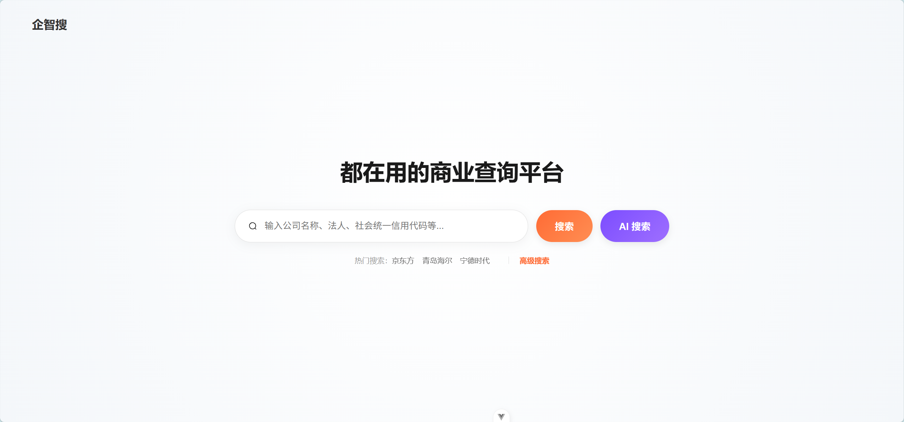

# Enterprise Intelligence Search - 基于 LangChain4j + DeepSeek 的全栈企业级 AI 智能搜索引擎

[](https://spring.io/projects/spring-boot)
[](https://github.com/langchain4j/langchain4j)
[](https://www.elastic.co/)
[](https://www.deepseek.com/)
[](https://www.xuxueli.com/xxl-job/)
[](https://vuejs.org/)

---

## 🚀 项目简介

本项目是一款融合了 **传统大数据精准搜索** 与 **大模型语义分析** 的全栈智能助手。通过 **RAG (Retrieval-Augmented Generation)** 架构，深度集成 LangChain4j 与 DeepSeek，解决了垂直领域数据缺失导致的 AI "幻觉"问题。

**核心解决痛点：**
- **数据时效性**：通过实时检索工商数据库，补齐大模型训练数据的滞后性。
- **准确性**：强制 AI "先查后说"，所有业务数据均来源于真实的 Elasticsearch 索引。
- **深度分析**：支持用户上传私有研报，利用向量搜索实现基于长文档的深度问答。
- **自动化运维**：集成 XXL-Job 实现全链路定时垃圾回收，覆盖 MySQL / ES / MinIO 三大存储。

### 📊 项目规模
- **总代码行数**：约 **10,909 行** (核心源码，排除第三方库与构建产物)
- **后端 Java 类**：50+ 核心类 (Agent / Tool / Service / Controller / Mapper)
- **前端页面**：6 个视图页面 (AI 对话 / 高级搜索 / 企业详情 / 列表 / 首页)
- **数据库表**：8 张核心业务表 (企业信息 / 股东 / 高管 / 专利 / 资质 / 会话 / 消息)
- **Elasticsearch 索引**：6 个业务索引 + 1 个向量索引
- **中间件依赖**：8 个 (MySQL / ES×2 / Redis / MinIO / XXL-Job / DeepSeek / BGE)

---

## �️ 后端核心架构设计

### 1. 双集群混合搜索架构 (Dual-Cluster Strategy)

针对不同业务场景，系统采用了创新的双 ES 集群架构，平衡了"海量检索"与"前沿 AI"的需求：

- **ES 7.4.0 (业务生产库)**：承载千万级结构化工商档案。利用其稳定的 **IK MaxWord** 分词能力和 **BoolQuery** 复合过滤，处理高并发的名称、法人、经营范围等精准搜索需求。
- **ES 8.9.0 (AI 向量基地)**：作为 RAG 的专属向量数据库。利用 8.9.0 原生的 **HNSW 算法** 和 `dense_vector` 特性，存储由 **BGE-Small-ZH** 模型生成的 512 维向量，实现毫秒级的语义相似度检索。
- **跨版本攻坚**：深入排查并解决了 LangChain4j 底层 8.x 客户端与 7.x 服务器的 **Content-Type (compatible-with=7/8)** 协议冲突。通过双配置类分别管理 `RestHighLevelClient` (7.x) 与 `ElasticsearchJavaClient` (8.x)，确保了双集群的平滑调度。
- **智能调度**：AI Agent 根据用户意图自动判断——查工商事实走 ES 7.4，查深度知识走 ES 8.9 向量库。

---

### 2. 企业精准搜索引擎 (Advanced Enterprise Search)

在传统搜索侧，系统构建了一个健壮的多维度过滤体系：

- **高级搜索页面**：前端 [AdvancedSearch.vue](./frontend/src/views/AdvancedSearch.vue) 提供可视化筛选面板，支持**企业状态、注册资本区间、成立年份**等多条件组合查询。
- **BoolQuery 复合过滤**：后端 [EsSearchQueryFactory.java](./search-main/src/main/java/com/qych/factory/EsSearchQueryFactory.java) 动态组装 `must`（关键词匹配）+ `filter`（精准过滤），确保搜索既快又准。
- **工商维度全覆盖**：涵盖企业基本信息、经营概况、股东、高管、专利、资质证书等六大核心数据域，每个域都有独立的 ES 索引和 MyBatis Mapper。
- **智能分词策略**：采用 IK MaxWord 细粒度分词，解决"深圳腾讯"与"深圳市腾讯计算机系统有限公司"之间的模糊匹配难题。

---

### 3. 多 Agent 协作体系 (Multi-Agent Workflow)

系统将 AI 逻辑解耦为三个专业 Agent，通过 Spring Bean 统一管理：

- **智能对话中枢 (EnterpriseChatAgent)**：集成 **Function Calling**。AI 会根据用户意图（闲聊 vs 查数）自动决策是否触发 `searchEnterprise` 或 `searchPrivateDocument` 工具。System Message 中植入了严格的"禁止寒暄"指令，确保 AI 在查数前不会输出任何废话。
- **企业速览专家 (CompanySummaryAgent)**：采用**定制化 System Message**。针对海量工商维度进行高度压缩，秒级生成 200 字以内的专业商业诊断报告。
- **智能标题助手 (TitleGeneratorAgent)**：利用非流式轻量模型，根据首轮对话自动生成具有业务辨识度的会话标题，如"腾讯控股经营状况分析"。

---

### 4. RAG 工业级数据闭环

实现了从原始文档到知识提取的全自动流水线：

- **对象存储 (MinIO)**：集成 MinIO 8.5.10，实现 PDF/Word 原始文档的分布式存储。封装 [MinioUtil.java](./search-main/src/main/java/com/qych/utils/MinioUtil.java) 工具类提供统一的上传/下载/删除 API。
- **文档解析**：集成 Apache POI 5.2.3（处理 Word）和 Tess4j（OCR 图片文字识别），支持多格式文档的内容提取。
- **智能切片 (Chunking)**：采用 LangChain4j 的 `DocumentSplitter`，结合语义边界对长文档进行切片，并自动注入 `sessionId` 等元数据实现多租户权限隔离。
- **向量化流水线**：利用本地量化模型 **BGE-Small-ZH-Quantized**，在不消耗 Token 的情况下，将文本片段转化为 512 维向量存入 ES 8.9.0。
- **检索增强**：AI 回答问题前，先通过 [KnowledgeBaseTool.java](./search-main/src/main/java/com/qych/tool/KnowledgeBaseTool.java) 从向量库中检索相关片段，将背景知识作为 Context 喂给大模型，生成有据可查的专业回复。

---

### 5. 分布式定时任务 (XXL-Job)

系统引入了 XXL-Job 2.3.1 分布式任务调度平台，解决了**数据的全生命周期管理**问题：

- **配置层**：[XxlJobConfig.java](./search-main/src/main/java/com/qych/config/XxlJobConfig.java) 标准初始化执行器，支持自动注册到调度中心。
- **核心任务**：[ChatDataCleanupJob.java](./search-main/src/main/java/com/qych/job/ChatDataCleanupJob.java) 实现了**全链路定时垃圾回收**，通过 `@XxlJob("cleanDeletedChatDataJob")` 注解注册：
    1. 查询标记为删除的会话 ID。
    2. 调用 `KnowledgeBaseService` 删除 ES 8.9.0 中对应的向量数据。
    3. 遍历聊天记录，通过 MinioUtil 删除 MinIO 中的附件文件。
    4. 物理删除 MySQL 中的聊天消息。
    5. 物理删除 MySQL 中的会话记录。
- **多数据源编排**：单次任务横跨 **Elasticsearch + MinIO + MySQL** 三大存储，展示了分布式环境下的数据一致性保障能力。

---

### 6. 高性能交互与安全优化

- **SSE 流式渲染**：基于 **Server-Sent Events** 协议，结合自定义 `SseEmitter` 和 `TokenStream`，实现打字机式实时交互，首字延迟（TTFT）优化至 200ms 以内。
- **多线程异步处理**：在生成企业摘要等长任务时，使用 `CompletableFuture` 配合自定义线程池，避免阻塞 Tomcat Web 线程。
- **JWT 认证体系**：集成 jjwt 0.9.1 实现无状态 Token 认证，配合登录拦截器保护 AI 对话接口不被未授权访问。
- **全局异常拦截**：通过 [GlobalExceptionHandler.java](./search-utils/src/main/java/com/qych/utils/exception/GlobalExceptionHandler.java) 统一处理业务异常、参数校验异常和系统异常，返回标准化的 `BaseResponse` JSON 结构。
- **API 文档**：集成 Knife4j 2.0.9，提供在线可调试的 Swagger 接口文档。

---

## 🛠️ 技术栈详情

### 后端 (Backend)

| 层级 | 技术选型 | 说明 |
| :--- | :--- | :--- |
| **核心框架** | Spring Boot 2.7.18, Java 11 | 稳定的 LTS 版本，Maven 多模块管理 |
| **AI 编排** | LangChain4j 0.32.0 | Agent、Tool Calling、RAG 统一编排 |
| **大模型** | DeepSeek-Chat | 通过 OpenAI 兼容接口接入，成本低效果好 |
| **向量模型** | BGE-Small-ZH-Quantized | 本地运行，512 维，不消耗 API Token |
| **业务搜索** | Elasticsearch 7.4.0 | IK MaxWord 分词，千万级工商数据 |
| **向量存储** | Elasticsearch 8.9.0 | HNSW 算法，dense_vector 原生支持 |
| **关系数据库** | MySQL 8.0 + MyBatis Plus 3.5.3 | 企业核心数据持久化 |
| **缓存** | Redis (Lettuce 连接池) | 热点数据、会话状态缓存 |
| **对象存储** | MinIO 8.5.10 | PDF/Word 研报分布式存储 |
| **任务调度** | XXL-Job 2.3.1 | 分布式定时全链路数据清理 |
| **安全认证** | JWT (jjwt 0.9.1) | 无状态 Token，登录拦截器 |
| **API 文档** | Knife4j 2.0.9 | Swagger 增强，在线调试 |
| **文档解析** | Apache POI 5.2.3 + Tess4j 5.8.0 | Word/图片文字提取 |
| **工具库** | Lombok, Fastjson, AhoCorasick | 代码简化与高性能文本匹配 |

### 前端 (Frontend)

| 层级 | 技术选型 | 说明 |
| :--- | :--- | :--- |
| **核心框架** | Vue 3.5 (Composition API) | `<script setup>` 语法，组合式 API |
| **构建工具** | Vite 8 | 极速冷启动，HMR 热更新 |
| **路由** | Vue Router 5 | SPA 页面导航 |
| **UI 组件库** | Element Plus 2.13 | 企业级中后台 UI 组件 |
| **数据可视化** | ECharts 6 | 企业画像图表展示 |
| **Markdown 渲染** | Marked 18 | AI 回复实时流式渲染 |
| **HTTP 客户端** | Axios | 请求拦截、SSE 流读取 |
| **PDF 导出** | html2pdf.js | 企业报告一键导出 |

---

## 📂 项目结构

```text
enterprise-search
├── search-main                       # 后端核心业务模块
│   ├── src/main/java/com/qych/
│   │   ├── agent/                    # AI Agent 定义
│   │   │   ├── EnterpriseChatAgent.java    # 核心对话中枢 (Function Calling)
│   │   │   ├── CompanySummaryAgent.java    # 企业速览诊断专家
│   │   │   └── TitleGeneratorAgent.java    # 会话标题智能生成
│   │   ├── tool/                     # AI 可调用工具链
│   │   │   ├── EnterpriseSearchTool.java   # ES 7.4 工商精准查询工具
│   │   │   └── KnowledgeBaseTool.java      # ES 8.9 向量语义检索工具
│   │   ├── config/                   # 配置类
│   │   │   ├── AiConfig.java               # AI 模型/Agent/向量库 统一配置
│   │   │   ├── XxlJobConfig.java           # XXL-Job 执行器配置
│   │   │   └── ...                         # ES/MyBatis/MinIO 等配置
│   │   ├── job/                      # XXL-Job 定时任务
│   │   │   └── ChatDataCleanupJob.java     # 全链路垃圾回收 (ES+MinIO+MySQL)
│   │   ├── controller/               # REST 接口层
│   │   │   ├── AiChatController.java       # SSE 流式 AI 对话
│   │   │   ├── EnterpriseSearchController.java # 高级多维度搜索
│   │   │   └── KnowledgeBaseController.java    # RAG 知识库管理 (上传/删除)
│   │   ├── service/                  # 业务逻辑层
│   │   │   ├── impl/AiChatServiceImpl.java # AI 对话流式处理核心
│   │   │   ├── KnowledgeBaseService.java   # 文档向量化与检索
│   │   │   └── ...                         # 企业搜索/用户管理等
│   │   ├── repository/               # Elasticsearch 仓储接口
│   │   ├── entity/                   # POJO / VO / ES 文档实体
│   │   └── utils/                    # MinioUtil、SseManager 等工具
│   └── src/main/resources/
│       ├── application.yml                 # 主配置 (双ES/Redis/MinIO/XXL-Job)
│       └── mapper/                         # MyBatis XML 映射文件 (6 张核心表)
│
├── search-utils                      # 后端通用工具模块
│   └── src/main/java/com/qych/utils/
│       ├── pojo/BaseResponse.java          # 统一响应体封装
│       ├── exception/GlobalExceptionHandler.java # 全局异常拦截
│       └── ...                             # 其他通用工具
│
├── frontend                          # 前端 Vue 3 项目
│   ├── src/
│   │   ├── views/
│   │   │   ├── AiSearchPage.vue            # AI 智能对话页 (SSE 流式渲染)
│   │   │   ├── AdvancedSearch.vue          # 高级企业搜索页 (多维度筛选)
│   │   │   ├── HomeView.vue                # 首页门户
│   │   │   ├── List.vue                    # 搜索结果列表页
│   │   │   ├── Detail.vue                  # 企业详情页 (含ECharts画像)
│   │   │   └── ...                         # 更多组件
│   │   ├── router/index.js                 # 前端路由配置
│   │   ├── App.vue                         # 根组件
│   │   └── main.js                         # 入口文件
│   ├── package.json
│   └── vite.config.js
│
├── pom.xml                           # 父 POM (版本统一管理)
└── README.md                         # 项目说明文档
```

---

## 🔄 核心业务流程

### 流程一：AI 智能企业查询
```
用户输入自然语言提问
    │
    ▼
EnterpriseChatAgent 解析意图 (Function Calling)
    │
    ├── 查工商事实 ──► EnterpriseSearchTool ──► ES 7.4 BoolQuery 检索 ──► 返回格式化数据
    │
    └── 深度分析 ──► KnowledgeBaseTool ──► ES 8.9 向量检索 ──► 返回知识片段
    │
    ▼
DeepSeek 整合多源数据，通过 SSE 流式返回专业回复
```

### 流程二：RAG 知识库构建
```
用户上传 PDF/Word → MinIO 存储原始文件 → Apache POI 解析文本
    → DocumentSplitter 智能切片 → BGE 模型生成 512 维向量
    → 存入 ES 8.9.0 (带 sessionId 权限标签) → AI 问答时可检索
```

### 流程三：定时全链路清理
```
XXL-Job 调度中心触发 cleanDeletedChatDataJob
    → 查询 MySQL 中标记删除的会话
    → KnowledgeBaseService 删除 ES 8.9 向量
    → MinioUtil 删除 MinIO 附件
    → Mapper 物理删除 MySQL 消息/会话记录
```

---

## 🎨 效果演示

###  首页


###  AI 智能对话


### 企业数据搜索


### 企业详情


---

## 🚀 快速开始

### 1. 环境准备

| 组件 | 版本 | 端口 | 用途 |
| :--- | :--- | :--- | :--- |
| MySQL | 8.0+ | 3306 | 业务数据持久化 |
| Elasticsearch (业务) | 7.4.0 | 9200 | 工商数据全文检索 |
| Elasticsearch (向量) | 8.9.0 | 9201 | AI 向量存储与检索 |
| Redis | 6+ | 6379 | 缓存与会话管理 |
| MinIO | 最新稳定版 | 9000 | 文档对象存储 |
| XXL-Job Admin | 2.3.1 | 8888 | 分布式任务调度中心 |

### 2. 配置环境变量
复制 `.env.example` 为 `.env`，填入你的配置：

```bash
# 方式一：使用 .env 文件 (推荐)
# 复制 .env.example 为 .env，编辑其中的关键参数
cp .env.example .env

# 方式二：或直接设置环境变量 (Windows PowerShell)
$env:DEEPSEEK_API_KEY="你的API Key"
$env:DEEPSEEK_BASE_URL="https://api.deepseek.com"
$env:JWT_SECRET_KEY="你的JWT密钥(至少32位)"
```

### 3. 后端启动
```bash
mvn clean install -DskipTests
cd search-main
mvn spring-boot:run
```

### 4. 前端启动
```bash
cd frontend
npm install
npm run dev
```

### 5. 访问地址
- **AI 对话页面**：`http://localhost:5173` (Vite 默认端口)
- **API 文档 (Knife4j)**：`http://localhost:8080/doc.html`
- **XXL-Job 调度中心**：`http://localhost:8888/xxl-job-admin`

---

### 所需环境变量一览

| 变量名 | 必填 | 默认值 | 说明 |
| :--- | :---: | :--- | :--- |
| `DEEPSEEK_API_KEY` | ✅ | — | DeepSeek API 密钥 |
| `DEEPSEEK_BASE_URL` | ✅ | `https://api.deepseek.com` | DeepSeek API 地址 |
| `JWT_SECRET_KEY` | ✅ | — | JWT 签名密钥 |
| `MYSQL_HOST` | ❌ |  — | MySQL 主机 |
| `REDIS_PASSWORD` | ❌ | — | Redis 密码 |
| `MINIO_SECRET_KEY` | ❌ | — | MinIO 密钥 |

---

## 📄 授权协议

本项目遵循 MIT 开源协议。欢迎 Fork 和 Star ⭐，如有问题请提交 Issue。

---

**如果这个项目对你有帮助，请在 GitHub 上给个 Star ⭐，你的支持是我最大的动力！**
